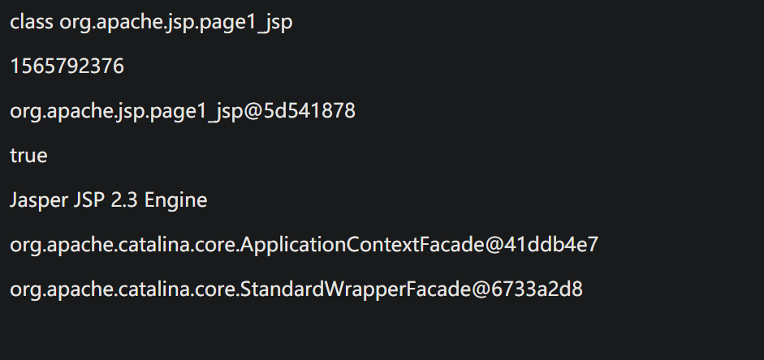
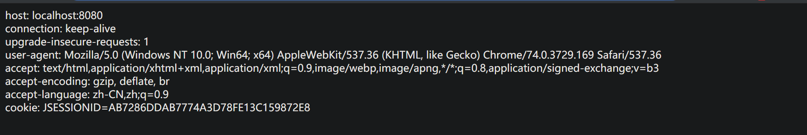
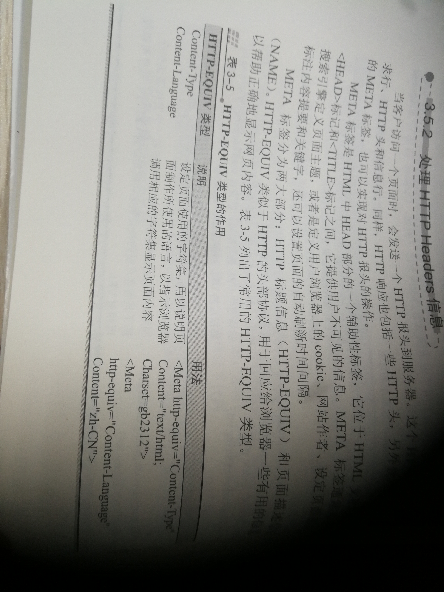

#相应文件所对应的功能

####此案例是本人在学习《Java Web开发实践教程》所作,对应第三章

### out1.jsp
```$xslt
管理缓冲区
```

### page1.jsp
```$xslt
页面对象page
page常用的属性
hashCode()
getClass()
toString()
equals()
this.getServletConfig()
this.getServletInfo()
```



### 页面请求对象request

```$xslt
request1.jsp获得的是Http Headers信息

```



### 关于中文乱码问题的解决
```$xslt
就我目前看来,一般情况下提交方式如果是get的话则不容易出现乱码,如果是提交方式是post
则需要特殊处理,
```

#### 提交方式为get的乱码的解决(本人未试验过)
请参考get1.jsp和handle1.jsp
```$xslt
方案一:
 String usr = request.getParameter("usr");
    String name = new String(usr.getBytes("ISO-8859-1"),"UTF-8");
    
 方案二:
 修改server.xml:
 更改tomcat默认提交方式的代码,在改端口号的地方,加入URIEncoding="UTF-8"
```


#### 提交方式未post的乱码解决
关于提交方式为post的请参考post1和handle2
```aidl
方法一:
可以如同get乱码解决方案一样
String usr = request.getParameter("usr");
String name = new String(usr.getBytes("ISO-8859-1"),"UTF-8");


方法二:
在一开始就
request.setCharacterEncoding("utf-8");

```


### response对象成员方法

```aidl
addCookie()
encodingRedirect()
sendError(int code,String message)
sendRedirect()

```

### HTTP-EQUIV类型的补充



天道酬勤